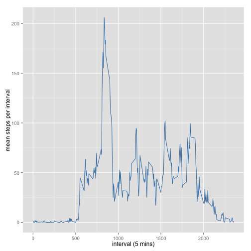
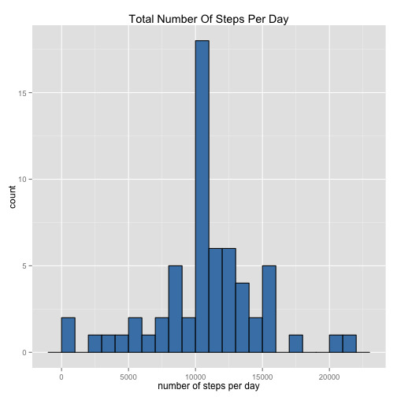
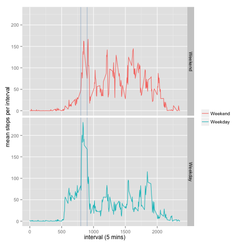

#Reproducible Research: Peer Assessment 1

##*Quick preparation*

Loading libraries:


```r
if(!require("data.table")){
  install.packages("data.table")
  library("data.table")
}
if(!require("plyr")){
  install.packages("plyr")
  library("plyr")
}
if(!require("dplyr")){
  install.packages("dplyr")
  library("dplyr")
}
if(!require("tidyr")){
  install.packages("tidyr")
  library("tidyr")
}
if(!require("knitr")){
  install.packages("knitr")
  library("knitr")
}
if(!require("ggplot2")){
  install.packages("ggplot2")
  library("ggplot2")
}
if(!require("lubridate")){
  install.packages("lubridate")
  library("lubridate")
}
```

Setting options:


```r
opts_chunk$set(echo = TRUE,fig.width = 7, fig.height = 7)
```

## Loading and preprocessing the data


```r
#read the data from the zip archive
mov.data<-read.csv(file = unz("activity.zip", "activity.csv" ), stringsAsFactors = FALSE, header = TRUE)
#convert the data to data (duh!) from character
mov.data<-mov.data %>% transform(.,date=as.Date(x=date))
#quick sanity check
head(mov.data)
```

```
##   steps       date interval
## 1    NA 2012-10-01        0
## 2    NA 2012-10-01        5
## 3    NA 2012-10-01       10
## 4    NA 2012-10-01       15
## 5    NA 2012-10-01       20
## 6    NA 2012-10-01       25
```

```r
#The dataset is stored in a comma-separated-value (CSV) file and there are a total of 17,568 observations in this dataset.
assertthat::are_equal(nrow(mov.data),17568)
```

```
## [1] TRUE
```


## What is mean total number of steps taken per day?


```r
#group by date, remove NAs, plot as histogram
summary.sum<-mov.data %>% group_by(date) %>% 
  summarize(sum.steps=sum(steps, na.rm = TRUE))
summary.sum %>% ggplot(data=., mapping=aes(x=sum.steps)) + geom_histogram(binwidth=1000, fill="steelblue", color="black") +
  xlab("number of steps per day") + ggtitle("Total Number Of Steps Per Day")
```

 

Mean steps per day: **9354**, median is: **10395**

## What is the average daily activity pattern?


```r
#group by interval and get the mean steps per interval
summary.mean <- mov.data %>% group_by(interval) %>% summarize(mean.steps=mean(steps, na.rm = TRUE))
summary.mean %>% ggplot(data=., mapping=aes(x=interval, y=mean.steps))+geom_line(color="steelblue") +
  xlab("interval (5 mins)") + ylab("mean steps per interval")
```

 

Maximum number of steps per 5 minute interval: **206**, which corresponds to the interval: **835**

## Imputing missing values

Summarize the data to see how many data points are missing:


```r
summary.na<-mov.data %>% group_by(is.na(steps)) %>% summarize(num.nas=n())
summary.na
```

```
## Source: local data frame [2 x 2]
## 
##   is.na(steps) num.nas
## 1        FALSE   15264
## 2         TRUE    2304
```

Number of missing steps data points (the `NA`s in the data table): **2304**. The suggestion is to simply **replace `NA` values with the means of the corresponding intervals** (imputing strategy).


```r
#merge by interval with a table with corresponding means,
mov.data.complete<- merge(x = mov.data, y = summary.mean, by="interval") %>% 
  #then simply look is steps==NA -> substitute by corresponding mean
  do({
  .$steps<-sapply(1:nrow(.), function(x){
    return(ifelse(is.na(.$steps[x]),yes = .$mean.steps[x], no = .$steps[x]))
  })
  return(.)
  #remove the unnessessary mean.steps
}) %>% select(interval, steps, date)

#plot the new histogram
summary.sum.complete<-mov.data.complete %>% group_by(date) %>% 
  summarize(sum.steps=sum(steps))
summary.sum.complete %>% ggplot(data=., mapping=aes(x=sum.steps)) + geom_histogram(binwidth=1000, fill="steelblue", color="black") +
  xlab("number of steps per day") + ggtitle("Total Number Of Steps Per Day")
```

 

Mean steps per day: **10766**, median is: **10766**  
Both total **mean** and **median** are *higher* then previously (see above) after the `NA` values were substituted by the corresponding interval means. Obviously (as they say in maths books, especially when it is anything but obvious), this stems from the lack of proper data in the previous dataset, where many intervals have `NA` values for steps, and the total numbers of steps for such days ==0. To be more specific, the previous dataset had **15264** complete cases and **61** sums by intervals, hence,  
**`mean = sum(summary.sum$sum.steps)/nrow(summary.sum)=`570608`/`61`=`9354**,  
however, the imputed dataset has  
**`mean = sum(summary.sum.complete$sum.steps)/nrow(summary.sum.complete)=`656737`/`61`=`10766**  
because previous "total zeros" have been substituted by means. The same thing affects the median.

## Are there differences in activity patterns between weekdays and weekends?


```r
day.type<-c("Weekend", "Weekday")
week.end.day<-factor(day.type,levels=day.type)
week.end.day
```

```
## [1] Weekend Weekday
## Levels: Weekend Weekday
```

```r
#days in lubridate are 1:7, where 1=Sumday, 7=Monday
mov.data.complete %>% 
  #return 1+TRUE or FALSE, which is an index on week.end.day
  mutate(weekday=sapply(.$date, function(x){return(week.end.day[1+((wday(x)>1&&wday(x)<7))])})) %>%
  #get a summary by weekends and weekdays
  group_by(interval,weekday) %>% summarize(mean.steps=mean(steps)) %>%
  #make two simple line plots for the data
  ggplot(data=., mapping=aes(x=interval,y=mean.steps, group=weekday, color=weekday)) + geom_line() + facet_grid(weekday~.)+
   xlab("interval (5 mins)") + ylab("mean steps per interval") + geom_vline(x=800, color="steelblue", alpha=0.4) + geom_vline(x=900, color="steelblue", alpha=0.4) +
  theme(legend.title=element_blank())
```

 

My understanding is that there are **12** intervals per hour, and the beginning of each hour is marked by increase in 100 to the previous interval id (like 55 is the last interval for the first hour, next comes 100 instead of 60, see *Loading and preprocessing the data*), which means that the interval **800** (see the leftmost green line on the plots above) is **8.00 AM** (asuming the timing starts at 0.00 AM). If that is correct, the spike in the steps on the **"Weekday"** panel is a result of morning "rushing" from **8.00 AM** till **9.00 AM** on weekdays. In contrast, the "rushing" seems to take place on the weekends as well, but nevertheless, a lot of "sleeping in" seems to take place (multiple spikes after ~900, corresponding to 9.00 AM).
