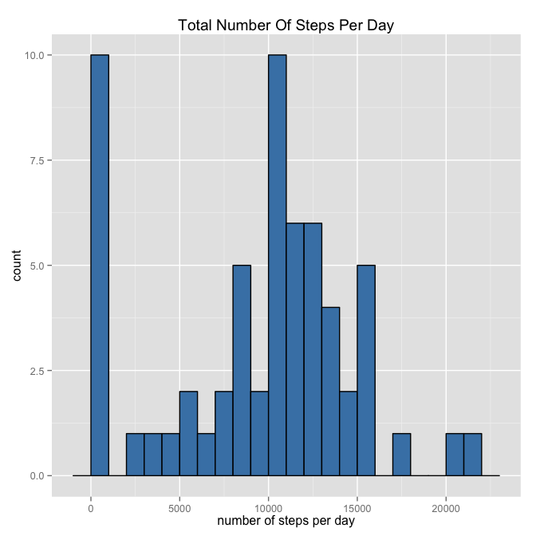
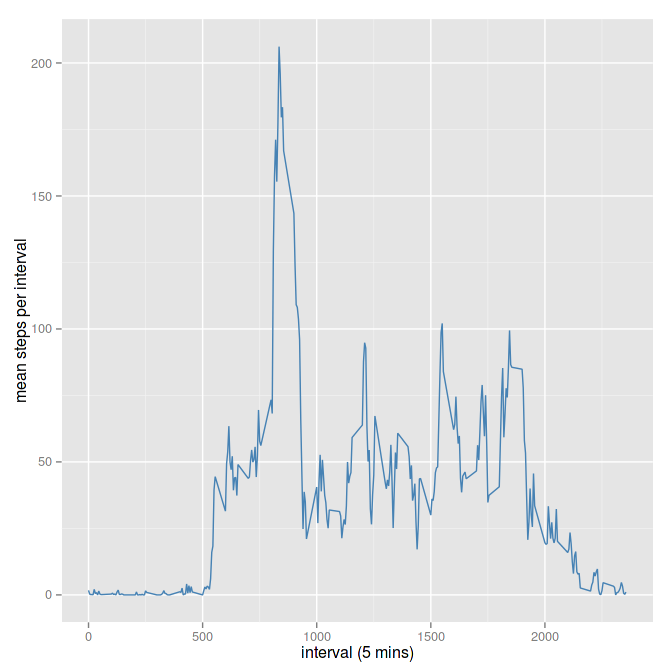

# Reproducible Research: Peer Assessment 1
##*Quick preparation*

Loading libraries:


```r
if(!require("plyr")){
  install.packages("plyr")
  library("plyr")
}
```

```
## Loading required package: plyr
```

```r
if(!require("dplyr")){
  install.packages("dplyr")
  library("dplyr")
}
```

```
## Loading required package: dplyr
## 
## Attaching package: 'dplyr'
## 
## The following objects are masked from 'package:plyr':
## 
##     arrange, count, desc, failwith, id, mutate, rename, summarise,
##     summarize
## 
## The following objects are masked from 'package:stats':
## 
##     filter, lag
## 
## The following objects are masked from 'package:base':
## 
##     intersect, setdiff, setequal, union
```

```r
if(!require("tidyr")){
  install.packages("tidyr")
  library("tidyr")
}
```

```
## Loading required package: tidyr
```

```r
if(!require("knitr")){
  install.packages("knitr")
  library("knitr")
}
```

```
## Loading required package: knitr
```

```r
if(!require("ggplot2")){
  install.packages("ggplot2")
  library("ggplot2")
}
```

```
## Loading required package: ggplot2
```

Setting options:


```r
opts_chunk$set(echo = TRUE,fig.width = 7, fig.height = 7)
```

## Loading and preprocessing the data


```r
#read the data from the zip archive
mov.data<-read.csv(file = unz("activity.zip", "activity.csv" ), stringsAsFactors = FALSE, header = TRUE)
#convert the data to data (duh!) from character
mov.data<-mov.data %>% transform(.,date=as.Date(x=date))
#quick sanity check
head(mov.data)
```

```
##   steps       date interval
## 1    NA 2012-10-01        0
## 2    NA 2012-10-01        5
## 3    NA 2012-10-01       10
## 4    NA 2012-10-01       15
## 5    NA 2012-10-01       20
## 6    NA 2012-10-01       25
```

```r
#The dataset is stored in a comma-separated-value (CSV) file and there are a total of 17,568 observations in this dataset.
assertthat::are_equal(nrow(mov.data),17568)
```

```
## [1] TRUE
```


## What is mean total number of steps taken per day?


```r
#group by date, remove NAs, plot as histogram
summary.sum<-mov.data %>% group_by(date) %>% 
  summarize(sum.steps=sum(steps, na.rm = TRUE))
summary.sum %>% ggplot(data=., mapping=aes(x=sum.steps)) + geom_histogram(binwidth=1000, fill="steelblue", color="black") +
  xlab("number of steps per day") + ggtitle("Total Number Of Steps Per Day")
```

 

Mean steps per day: **9354**, median is: **10395**

## What is the average daily activity pattern?


```r
#group by interval and get the mean steps per interval
summary.mean <- mov.data %>% group_by(interval) %>% summarize(mean.steps=mean(steps, na.rm = TRUE))
summary.mean %>% ggplot(data=., mapping=aes(x=interval, y=mean.steps))+geom_line(color="steelblue") +
  xlab("interval (5 mins)") + ylab("mean steps per interval")
```

 

Maximum number of steps per 5 minute interval: **206**, which corresponds to the interval: **835**

## Imputing missing values


## Are there differences in activity patterns between weekdays and weekends?
